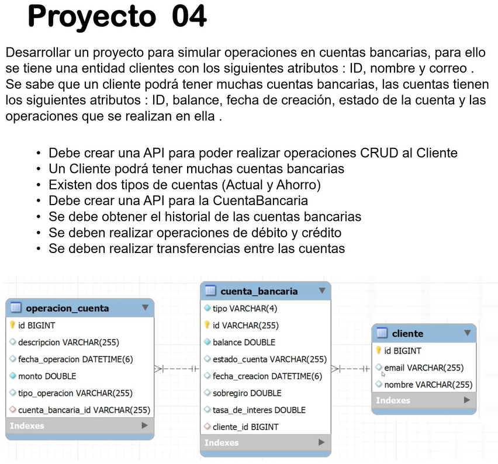
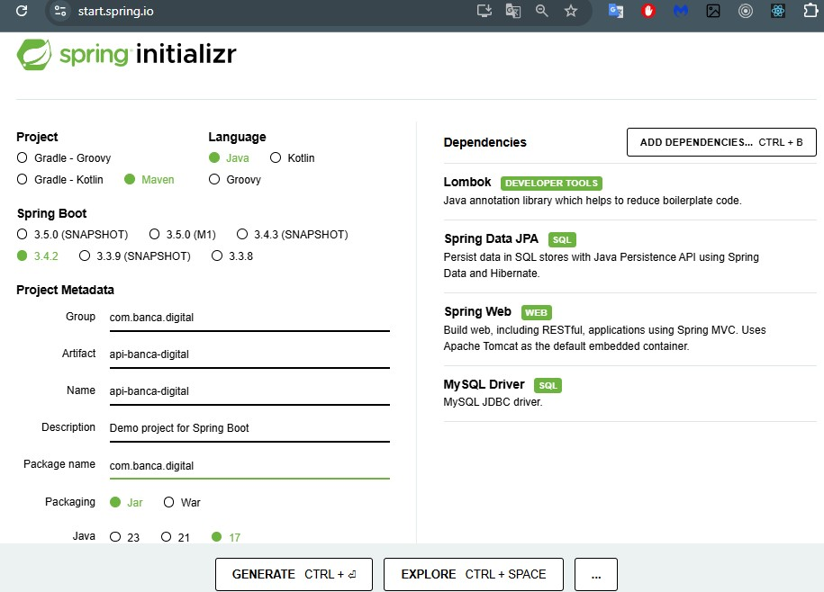

# Proyecto 04: Simulación de Operaciones en Cuentas Bancarias

Este proyecto tiene como objetivo desarrollar una API para simular operaciones en cuentas bancarias.

<div align="center">
   <h1>Challenge | Java | Back End - SpringBoot | API REST - Banca Digital</h1>
</div>


<p align="center">
  <br>
  
  
</p>

👨🏻‍💻 <strong>Gerson Escobedo Pérez </strong></br>
<a href="https://www.linkedin.com/in/gerson-escobedo/" target="_blank">
</a>


## Descripción
Se implementará una API que permita gestionar clientes y sus cuentas bancarias. Los clientes tienen los siguientes atributos:
- **ID**
- **Nombre**
- **Correo**

Cada cliente puede tener múltiples cuentas bancarias, y las cuentas tienen los siguientes atributos:
- **ID**
- **Balance**
- **Fecha de creación**
- **Estado de la cuenta**
- **Operaciones realizadas**

## Requerimientos
- Crear una API para realizar operaciones **CRUD** en la entidad **Cliente**.
- Permitir que un cliente tenga múltiples cuentas bancarias.
- Manejar dos tipos de cuentas:
    - **Cuenta Actual**
    - **Cuenta de Ahorro**
- Crear una API para gestionar la entidad **CuentaBancaria**.
- Obtener el historial de operaciones realizadas en las cuentas bancarias.
- Implementar operaciones de **débito** y **crédito** en las cuentas.
- Permitir realizar **transferencias** entre cuentas bancarias.

### Imagen de Requerimientos


### Dependencias del Proyecto


## 🖥️ Tecnologías utilizadas
- ☕ Java 17
- JPA Hibernate
- [Intellij](https://www.jetbrains.com/idea/)
- [MySql](https://www.mysql.com/)
- [Java](https://www.java.com/en/)

## ⚠️ Importante! ⚠️
☕ Usar Java versión 8 o superior para compatibilidad. </br></br>
📝 Recomiendo usar el editor de Intellij</br></br>

## Instalación

1. Clonar el repositorio:
   ```bash
   git clone https://github.com/Gerson121295/SWR-P04-BancaDigital.git
   ```
2. Navegar al directorio del proyecto:
   ```bash
   cd <SWR-P03-Encuestas>
   ```
3. Construir el proyecto con Maven:
   ```bash
   mvn clean install
   ```
4. Ejecutar la aplicación:
   ```bash
   mvn spring-boot:run
   ```
## Endpoints

### Operaciones de Cuenta Bancaria

#### Listar Cuentas
**GET** - `http://localhost:8080/api/v1/cuentas`

#### Listar Cuenta por ID
**GET** - `http://localhost:8080/api/v1/cuentas/{cuentaId}`

#### Listar Historial de Operaciones de una Cuenta
**GET** - `http://localhost:8080/api/v1/cuentas/{cuentaId}/operaciones`

#### Listar Historial de Operaciones con Paginación
**GET** - `http://localhost:8080/api/v1/cuentas/{cuentaId}/pageOperaciones`
- **Parámetros:**
    - `page`: Número de página (por ejemplo, `3`)
    - `size`: Cantidad de resultados por página (por ejemplo, `5`)
- **Ejemplo:** `http://localhost:8080/api/v1/cuentas/{cuentaId}/pageOperaciones?page=3&size=5`

#### Retirar de la Cuenta (Débito)
**POST** - `http://localhost:8080/api/v1/cuentas/debito`
- **Body:**
```json
{
  "cuentaId": "acbca23d-bf64-4eb1-a863-5a9afd4e34d4",
  "monto": 7985,
  "descripcion": "donacion"
}
```

#### Depositar a la Cuenta (Crédito)
**POST** - `http://localhost:8080/api/v1/cuentas/credito`
- **Body:**
```json
{
  "cuentaId": "acbca23d-bf64-4eb1-a863-5a9afd4e34d4",
  "monto": 50000,
  "descripcion": "Deposito venta de casa"
}
```

#### Transferencia entre Cuentas
**POST** - `http://localhost:8080/api/v1/cuentas/transferencia`
- **Body:**
```json
{
  "cuentaPropietario": "acbca23d-bf64-4eb1-a863-5a9afd4e34d4",
  "cuentaDestinatario": "95fe7abc-62b6-450e-a437-7ce7cb17005e",
  "monto": 10000,
  "descripcion": "Pago por servicios"
}
```

### Operaciones de Cliente

#### Listar Clientes
**GET** - `http://localhost:8080/api/v1/clientes`

#### Buscar Cliente por ID
**GET** - `http://localhost:8080/api/v1/clientes/{clienteId}`

#### Crear Cliente
**POST** - `http://localhost:8080/api/v1/clientes`
- **Body:**
```json
{
  "nombre": "Gema",
  "email": "gema@gmail.com"
}
```

#### Actualizar Cliente
**PUT** - `http://localhost:8080/api/v1/clientes/{clienteId}`
- **Body:**
```json
{
  "nombre": "Gema",
  "email": "gema@gmail.com"
}
```

#### Eliminar Cliente por ID
**DELETE** - `http://localhost:8080/api/v1/clientes/{clienteId}`

#### Buscar Clientes por Palabra Clave
**GET** - `http://localhost:8080/api/v1/clientes/search`
- **Parámetros:**
    - `keyword`: Palabra clave para la búsqueda (por ejemplo, `Biag`)
- **Ejemplo:** `http://localhost:8080/api/v1/clientes/search?keyword=Biag`

## Notas
- Asegúrate de que el servidor esté activo en `http://localhost:8080` para realizar las peticiones.
- Utiliza herramientas como Postman o cURL para probar los endpoints.
- Los IDs utilizados en los ejemplos son ficticios; reemplázalos por los correspondientes a tu base de datos.

# 💙 Personas Contribuyentes
## Autores
[<br><sub>Gerson Escobedo</sub>](https://github.com/gerson121295)

# Licencia


License: [MIT](License.txt)


